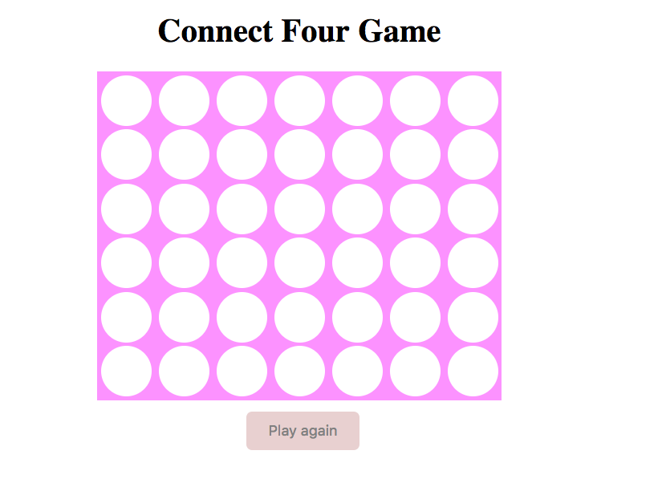
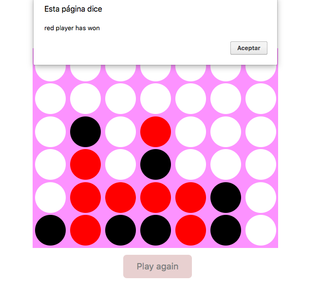

# Connect Four Game

My own version of Connect Four - a vertical checkers game.

In this game players take turns dropping their pieces into one of seven columns that have six rows of slots.

The first player to get their pieces into four slots that are vertically, horizontally, or diagonally contiguous wins the game.

## Features:

1. The board has six rows and seven columns

2. Two players take turns selecting a column to drop their checker into

3. When a player wins, a message appears to announce the victory

4. After a player wins, the game should reset and begin again

5. The gameplay should involve at least one animation (for example, the checkers could fall into their slot rather than just appear instantaneously)

### Images:

